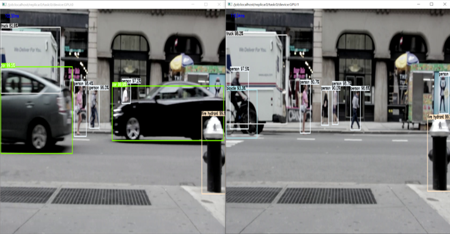

# Object Detection with MultiThreading using Tensorflow 
**한글**로 된 README를 보기 위해서는 해당 링크로 가면 됩니다 - [README-kr](/readme/README-kr.md)

This project is a tensorflow implementation of Faster RCNN, Mask RCNN, YOLO using **multithreading** to increase inference speed.
It was tested in NVIDIA GeForce GTX 1080 GPUs. There **isn't a code for training**, only codes to detect objects with pre-trained models. 
Webcam is not supported because the program must know total frames of the video before processing, but in real-time environment this is not possible.
The program goes through following processes:

1. Reads video file
2. Divides frames by number of gpus.
3. Using multithread, simultaneously detects objects with pre-trained models (Trained on **COCO**)<br/>
ex) If 2 gpus are detected total frames are divided into half. First half is processed in gpu 0 and second hal is processed in gpu 1.
4. Draws bounding boxes and labels simultaneously.
5. Joins frames processed through multithread and saves video.

While implementing, I referred to amazing implementations of other repositories listed below: 

* Tensorflow, Tensorflow-Yolo <br/>
https://github.com/tensorflow/models/tree/master/research/object_detection<br/> 
https://github.com/wizyoung/YOLOv3_TensorFlow<br/>


## Requirements

* Python 3.6
* imutils 0.5.2<br> 
```pip install opencv-python imutils```
* tensorflow 1.14.0
* tensorflow-gpu 1.1.0<br>
```pip install tensorflow tensorflow-gpu```


##How To Get Pre-trained Models
In the project pre-trained models were obtained from 3 sources. First, from tensorflow object detection api site.
Second, from yolo site. Third, pre-trained model that is automatically downloaded by pytorch framework. 
### 1. Tensorflow Object Detection API

1.1 Go to Tensorflow Object Detection API page
<br/>
https://github.com/tensorflow/models/blob/master/research/object_detection/g3doc/detection_model_zoo.md


1.2 Find table that looks like the image and download COCO pre-trained model.

### 2. Yolo
1.1 Go to Yolo page.<br/>
https://pjreddie.com/darknet/yolo/

1.2 Download pre-trained model, place files under `darknet` directory(The project was tested only on Yolov3)

## How To Convert Yolo pre-trained model 
In order to use yolo in tensorflow, the `.weights` file must be converted to `ckpt` file. 
First, make sure that `yolo_anchors.txt` file is under `darknet` directory.
Second, place downloaded `yolov3.weights` file and `yolov3.cfg` file under `darknet` directory<br/>
```Shell
python convert_weight.py
``` 
After the command, `ckpt` file and other necessary files for yolo object detection will be placed under `darknet` directory.

## Running Demos
Assuming that video file is under `assets` directory and yolo `weights, ckpt, cfg` files under `darknet` directory.
Replace `/path/to/...` part with actual path to files. Saving video is set to `False` as a default, so if you want to save 
you have to add `--save True`.
#### FasterRCNN Tensorflow
```Shell
python tensorflow_pretrained_multithreading.py --video assets/cars.mp4 --frozen /path/to/frozen_inference_graph.pb --conf 0.5 --save True
```

#### Yolo Tensorflow
```Shell
python tensorflow_yolo_tensorflow_pretrained_multithreading.py --video assets/cars.mp4 --ckpt darknet/yolov3.ckpt --conf 0.5 --nms 0.4 --anchor_path darknet/yolo_anchors.txt --save True
```
This is an output of object detection using 2 GPUs. Although detections are done concurrently it is saved to one single video.
<div align="center">

</div>
<div align="center">

</div>


### Credits:
Video by Pixabay from Pexels<br/>
Video by clara blasco from Pexels <br/>
Video by Pixly Videos from Pexels<br/>
Video by George Morina from Pexels <br/>
